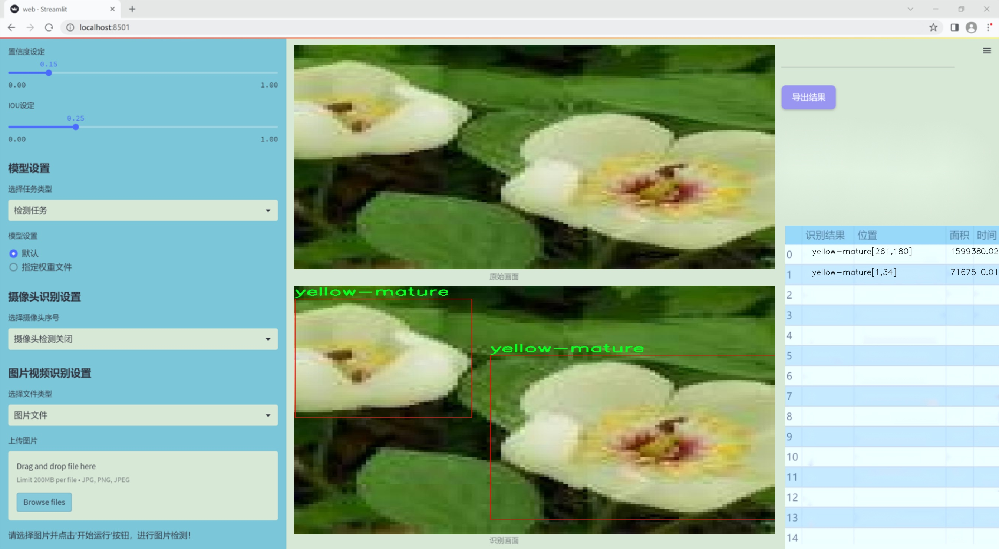
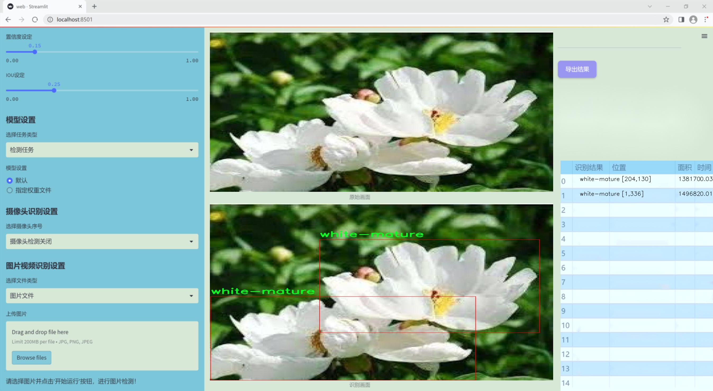
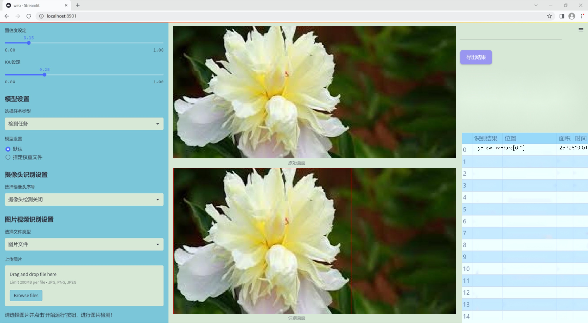
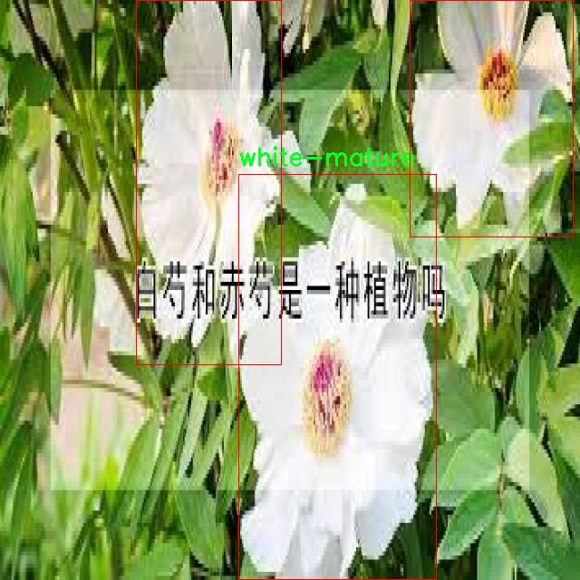
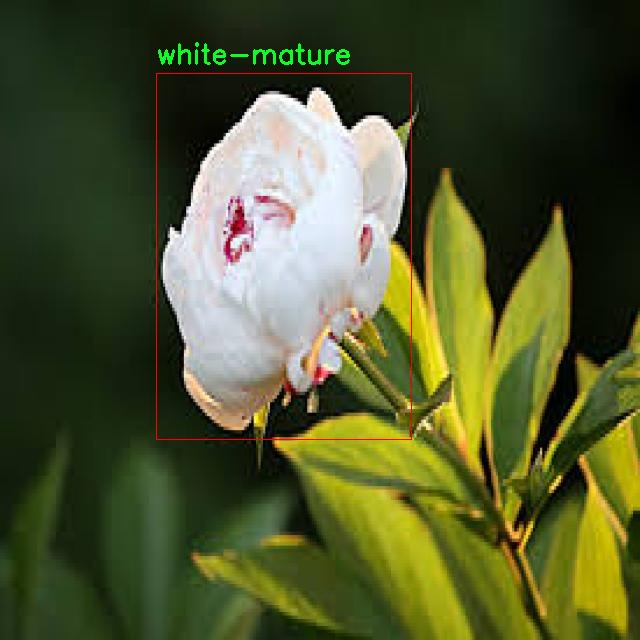
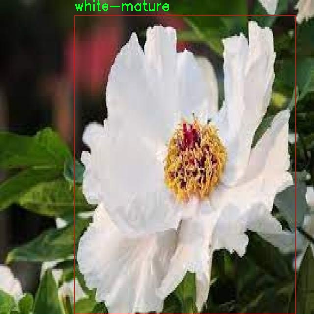
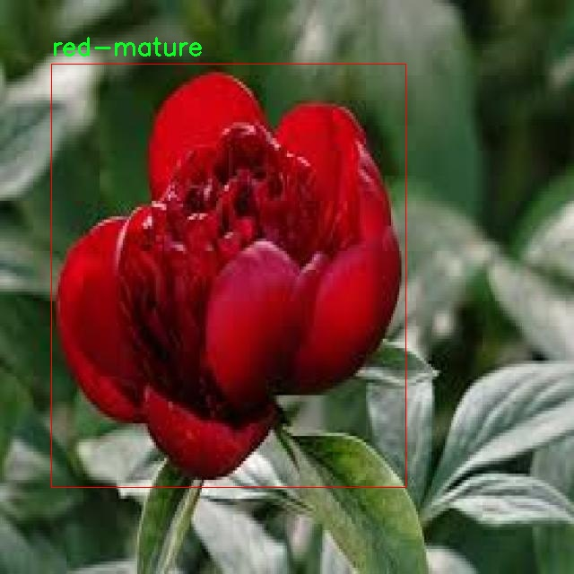

### 1.背景意义

研究背景与意义

白芍（Paeonia lactiflora Pall.）作为一种重要的中药材，广泛应用于中医药领域，其成熟度直接影响药材的质量和疗效。随着现代农业的发展和市场需求的增加，如何快速、准确地判断白芍的成熟度成为了一个亟待解决的问题。传统的人工检测方法不仅耗时耗力，而且容易受到主观因素的影响，导致检测结果的不一致性。因此，基于计算机视觉的自动化检测系统应运而生，能够有效提高检测效率和准确性。

在这一背景下，基于改进YOLOv11的白芍成熟度检测系统具有重要的研究意义。YOLO（You Only Look Once）系列算法以其快速的检测速度和较高的准确率在目标检测领域取得了显著的成果。通过对YOLOv11进行改进，结合白芍的特征，能够更好地适应白芍成熟度的检测需求。本研究利用一个包含77张图像的数据集，涵盖了五种成熟度类别：红色成熟、红色未成熟、白色成熟、白色未成熟和黄色成熟。这些类别的划分不仅有助于提高模型的识别能力，也为后续的药材分类提供了基础。

此外，数据集的构建与标注过程采用了YOLOv8格式，确保了数据的规范性和可用性。通过对图像进行自动方向调整和统一尺寸处理，提升了模型训练的效率。尽管未应用图像增强技术，但数据集的多样性和代表性为模型的训练提供了良好的基础。

综上所述，基于改进YOLOv11的白芍成熟度检测系统不仅能够推动白芍的智能化检测进程，还为中药材的质量控制提供了新的思路和方法，具有重要的理论价值和实际应用前景。

### 2.视频效果

[2.1 视频效果](https://www.bilibili.com/video/BV1XumtY4Ei2/)

### 3.图片效果







##### [项目涉及的源码数据来源链接](https://kdocs.cn/l/cszuIiCKVNis)**

注意：本项目提供训练的数据集和训练教程,由于版本持续更新,暂不提供权重文件（best.pt）,请按照6.训练教程进行训练后实现上图演示的效果。

### 4.数据集信息

##### 4.1 本项目数据集类别数＆类别名

train: ../train/images
val: ../valid/images
test: ../test/images

nc: 5
names: ['red-mature', 'red-unmature', 'white-mature', 'white-unmature', 'yellow-mature']

roboflow:
  workspace: smartcar-workspace
  project: -fc62p
  version: 1
  license: CC BY 4.0
  url: https://universe.roboflow.com/smartcar-workspace/-fc62p/dataset/1


该项目为【目标检测】数据集，请在【训练教程和Web端加载模型教程（第三步）】这一步的时候按照【目标检测】部分的教程来训练

##### 4.2 本项目数据集信息介绍

本项目数据集信息介绍

本项目旨在改进YOLOv11模型，以实现对白芍成熟度的精准检测。为此，我们构建了一个专门的数据集，涵盖了五种不同的白芍成熟度类别，具体包括：红色成熟、红色未成熟、白色成熟、白色未成熟和黄色成熟。这些类别的划分不仅有助于提高模型的识别能力，也为后续的应用提供了丰富的分类信息。

数据集的结构分为训练集、验证集和测试集，分别存放在指定的文件夹中。训练集位于“../train/images”，用于模型的训练过程，确保模型能够学习到不同成熟度的特征；验证集位于“../valid/images”，用于在训练过程中对模型的性能进行评估和调整；测试集则位于“../test/images”，用于最终的模型评估，以检验其在未见数据上的表现。

数据集中的类别数量为五个，这些类别不仅涵盖了白芍的不同成熟状态，还考虑到了颜色的变化，这对于农业领域的智能监测和管理具有重要意义。通过对这些类别的细致划分，模型能够更准确地识别和分类不同成熟度的白芍，从而为农业生产提供科学依据。

此外，本数据集遵循CC BY 4.0许可证，确保了其开放性和可共享性，鼓励研究人员和开发者在此基础上进行进一步的研究和应用。总之，本项目的数据集为改进YOLOv11的白芍成熟度检测系统提供了坚实的基础，期待其在实际应用中发挥重要作用。










### 5.全套项目环境部署视频教程（零基础手把手教学）

[5.1 所需软件PyCharm和Anaconda安装教程（第一步）](https://www.bilibili.com/video/BV1BoC1YCEKi/?spm_id_from=333.999.0.0&vd_source=bc9aec86d164b67a7004b996143742dc)


[5.2 安装Python虚拟环境创建和依赖库安装视频教程（第二步）](https://www.bilibili.com/video/BV1ZoC1YCEBw?spm_id_from=333.788.videopod.sections&vd_source=bc9aec86d164b67a7004b996143742dc)

### 6.改进YOLOv11训练教程和Web_UI前端加载模型教程（零基础手把手教学）

[6.1 改进YOLOv11训练教程和Web_UI前端加载模型教程（第三步）](https://www.bilibili.com/video/BV1BoC1YCEhR?spm_id_from=333.788.videopod.sections&vd_source=bc9aec86d164b67a7004b996143742dc)


按照上面的训练视频教程链接加载项目提供的数据集，运行train.py即可开始训练



     Epoch   gpu_mem       box       obj       cls    labels  img_size
     1/200     20.8G   0.01576   0.01955  0.007536        22      1280: 100%|██████████| 849/849 [14:42<00:00,  1.04s/it]
               Class     Images     Labels          P          R     mAP@.5 mAP@.5:.95: 100%|██████████| 213/213 [01:14<00:00,  2.87it/s]
                 all       3395      17314      0.994      0.957      0.0957      0.0843

     Epoch   gpu_mem       box       obj       cls    labels  img_size
     2/200     20.8G   0.01578   0.01923  0.007006        22      1280: 100%|██████████| 849/849 [14:44<00:00,  1.04s/it]
               Class     Images     Labels          P          R     mAP@.5 mAP@.5:.95: 100%|██████████| 213/213 [01:12<00:00,  2.95it/s]
                 all       3395      17314      0.996      0.956      0.0957      0.0845

     Epoch   gpu_mem       box       obj       cls    labels  img_size
     3/200     20.8G   0.01561    0.0191  0.006895        27      1280: 100%|██████████| 849/849 [10:56<00:00,  1.29it/s]
               Class     Images     Labels          P          R     mAP@.5 mAP@.5:.95: 100%|███████   | 187/213 [00:52<00:00,  4.04it/s]
                 all       3395      17314      0.996      0.957      0.0957      0.0845


###### [项目数据集下载链接](https://kdocs.cn/l/cszuIiCKVNis)

### 7.原始YOLOv11算法讲解


##### YOLOv11三大损失函数

YOLOv11（You Only Look Once）是一种流行的目标检测算法，其损失函数设计用于同时优化分类和定位任务。YOLO的损失函数通常包括几个部分：
**分类损失、定位损失（边界框回归损失）和置信度损失** 。其中，

  1. box_loss（边界框回归损失）是用于优化预测边界框与真实边界框之间的差异的部分。

  2. cls_loss（分类损失）是用于优化模型对目标类别的预测准确性的部分。分类损失确保模型能够正确地识别出图像中的对象属于哪个类别。

  3. dfl_loss（Distribution Focal Loss）是YOLO系列中的一种损失函数，特别是在一些改进版本如YOLOv5和YOLOv7中被引入。它的主要目的是解决目标检测中的类别不平衡问题，并提高模型在处理小目标和困难样本时的性能。

##### 边界框回归损失详解

box_loss（边界框回归损失）是用于优化预测边界框与真实边界框之间的差异的部分。


##### box_loss 的具体意义


##### 为什么需要 box_loss

  * 精确定位：通过最小化中心点坐标损失和宽高损失，模型能够更准确地预测目标的位置和大小。
  * 平衡不同类型的目标：使用平方根来处理宽高损失，可以更好地平衡不同大小的目标，确保小目标也能得到足够的关注。
  * 稳定训练：适当的损失函数设计有助于模型的稳定训练，避免梯度爆炸或消失等问题。

##### 分类损失详解

在YOLO（You Only Look
Once）目标检测算法中，cls_loss（分类损失）是用于优化模型对目标类别的预测准确性的部分。分类损失确保模型能够正确地识别出图像中的对象属于哪个类别。下面是关于cls_loss的详细解读：

##### 分类损失 (cls_loss) 的具体意义

  
分类损失通常使用交叉熵损失（Cross-Entropy
Loss）来计算。交叉熵损失衡量的是模型预测的概率分布与真实标签之间的差异。在YOLO中，分类损失的具体形式如下：


##### 为什么需要 cls_loss

  * 类别识别：cls_loss 确保模型能够正确识别出图像中的目标属于哪个类别。这对于目标检测任务至关重要，因为不仅需要知道目标的位置，还需要知道目标的类型。

  * 多类别支持：通过最小化分类损失，模型可以处理多个类别的目标检测任务。例如，在道路缺陷检测中，可能需要识别裂缝、坑洞、路面破损等多种类型的缺陷。

  * 提高准确性：分类损失有助于提高模型的分类准确性，从而提升整体检测性能。通过优化分类损失，模型可以更好地学习不同类别之间的特征差异。

##### 分布损失详解

`dfl_loss`（Distribution Focal
Loss）是YOLO系列中的一种损失函数，特别是在一些改进版本如YOLOv5和YOLOv7中被引入。它的主要目的是解决目标检测中的类别不平衡问题，并提高模型在处理小目标和困难样本时的性能。下面是对`dfl_loss`的详细解读：

##### DFL Loss 的背景

在目标检测任务中，类别不平衡是一个常见的问题。某些类别的样本数量可能远远多于其他类别，这会导致模型在训练过程中对常见类别的学习效果较好，而对罕见类别的学习效果较差。此外，小目标和困难样本的检测也是一个挑战，因为这些目标通常具有较少的特征信息，容易被忽略或误分类。

为了应对这些问题，研究者们提出了多种改进方法，其中之一就是`dfl_loss`。`dfl_loss`通过引入分布焦点损失来增强模型对困难样本的关注，并改善类别不平衡问题。

##### DFL Loss 的定义

DFL Loss
通常与传统的交叉熵损失结合使用，以增强模型对困难样本的学习能力。其核心思想是通过对每个类别的预测概率进行加权，使得模型更加关注那些难以正确分类的样本。

DFL Loss 的公式可以表示为：


##### DFL Loss 的具体意义**

  * **类别不平衡：** 通过引入平衡因子 α，DFL Loss 可以更好地处理类别不平衡问题。对于少数类别的样本，可以通过增加其权重来提升其重要性，从而提高模型对这些类别的检测性能。
  *  **困难样本：** 通过聚焦参数 γ，DFL Loss 可以让模型更加关注那些难以正确分类的样本。当 
  * γ 较大时，模型会对那些预测概率较低的样本给予更多的关注，从而提高这些样本的分类准确性。
  *  **提高整体性能** ：DFL Loss 结合了传统交叉熵损失的优势，并通过加权机制增强了模型对困难样本的学习能力，从而提高了整体的检测性能。


### 8.200+种全套改进YOLOV11创新点原理讲解

#### 8.1 200+种全套改进YOLOV11创新点原理讲解大全

由于篇幅限制，每个创新点的具体原理讲解就不全部展开，具体见下列网址中的改进模块对应项目的技术原理博客网址【Blog】（创新点均为模块化搭建，原理适配YOLOv5~YOLOv11等各种版本）

[改进模块技术原理博客【Blog】网址链接](https://gitee.com/qunmasj/good)


#### 8.2 精选部分改进YOLOV11创新点原理讲解

###### 这里节选部分改进创新点展开原理讲解(完整的改进原理见上图和[改进模块技术原理博客链接](https://gitee.com/qunmasj/good)【如果此小节的图加载失败可以通过CSDN或者Github搜索该博客的标题访问原始博客，原始博客图片显示正常】

### Gold-YOLO简介
YOLO再升级：华为诺亚提出Gold-YOLO，聚集-分发机制打造新SOTA
在过去的几年中，YOLO系列模型已经成为实时目标检测领域的领先方法。许多研究通过修改架构、增加数据和设计新的损失函数，将基线推向了更高的水平。然而以前的模型仍然存在信息融合问题，尽管特征金字塔网络（FPN）和路径聚合网络（PANet）已经在一定程度上缓解了这个问题。因此，本研究提出了一种先进的聚集和分发机制（GD机制），该机制通过卷积和自注意力操作实现。这种新设计的模型被称为Gold-YOLO，它提升了多尺度特征融合能力，在所有模型尺度上实现了延迟和准确性的理想平衡。此外，本文首次在YOLO系列中实现了MAE风格的预训练，使得YOLO系列模型能够从无监督预训练中受益。Gold-YOLO-N在COCO val2017数据集上实现了出色的39.9% AP，并在T4 GPU上实现了1030 FPS，超过了之前的SOTA模型YOLOv6-3.0-N，其FPS相似，但性能提升了2.4%。


#### Gold-YOLO


YOLO系列的中间层结构采用了传统的FPN结构，其中包含多个分支用于多尺度特征融合。然而，它只充分融合来自相邻级别的特征，对于其他层次的信息只能间接地进行“递归”获取。

传统的FPN结构在信息传输过程中存在丢失大量信息的问题。这是因为层之间的信息交互仅限于中间层选择的信息，未被选择的信息在传输过程中被丢弃。这种情况导致某个Level的信息只能充分辅助相邻层，而对其他全局层的帮助较弱。因此，整体上信息融合的有效性可能受到限制。
为了避免在传输过程中丢失信息，本文采用了一种新颖的“聚集和分发”机制（GD），放弃了原始的递归方法。该机制使用一个统一的模块来收集和融合所有Level的信息，并将其分发到不同的Level。通过这种方式，作者不仅避免了传统FPN结构固有的信息丢失问题，还增强了中间层的部分信息融合能力，而且并没有显著增加延迟。


# 8.低阶聚合和分发分支 Low-stage gather-and-distribute branch
从主干网络中选择输出的B2、B3、B4、B5特征进行融合，以获取保留小目标信息的高分辨率特征。


低阶特征对齐模块 (Low-stage feature alignment module)： 在低阶特征对齐模块（Low-FAM）中，采用平均池化（AvgPool）操作对输入特征进行下采样，以实现统一的大小。通过将特征调整为组中最小的特征大小（ R B 4 = 1 / 4 R ） （R_{B4} = 1/4R）（R 
B4 =1/4R），我们得到对齐后的特征F a l i g n F_{align}F align 。低阶特征对齐技术确保了信息的高效聚合，同时通过变换器模块来最小化后续处理的计算复杂性。其中选择 R B 4 R_{B4}R B4 作为特征对齐的目标大小主要基于保留更多的低层信息的同时不会带来较大的计算延迟。
低阶信息融合模块(Low-stage information fusion module)： 低阶信息融合模块（Low-IFM）设计包括多层重新参数化卷积块（RepBlock）和分裂操作。具体而言，RepBlock以F a l i g n ( c h a n n e l = s u m ( C B 2 ， C B 3 ， C B 4 ， C B 5 ) ) F_{align} (channel= sum(C_{B2}，C_{B3}，C_{B4}，C_{B5}))F align (channel=sum(C B2 ，C B3 ，C B4 ，C B5 )作为输入，并生成F f u s e ( c h a n n e l = C B 4 + C B 5 ) F_{fuse} (channel= C_{B4} + C_{B5})F fuse (channel=C B4 +C B5 )。其中中间通道是一个可调整的值（例如256），以适应不同的模型大小。由RepBlock生成的特征随后在通道维度上分裂为F i n j P 3 Finj_P3Finj P 3和F i n j P 4 Finj_P4Finj P 4，然后与不同级别的特征进行融合。


# 8.高阶聚合和分发分支 High-stage gather-and-distribute branch
高级全局特征对齐模块（High-GD）将由低级全局特征对齐模块（Low-GD）生成的特征{P3, P4, P5}进行融合。


高级特征对齐模块(High-stage feature alignment module)： High-FAM由avgpool组成，用于将输入特征的维度减小到统一的尺寸。具体而言，当输入特征的尺寸为{R P 3 R_{P3}R P3 , R P 4 R_{P4}R P4 , R P 5 R_{P 5}R P5 }时，avgpool将特征尺寸减小到该特征组中最小的尺寸（R P 5 R_{P5}R P5  = 1/8R）。由于transformer模块提取了高层次的信息，池化操作有助于信息聚合，同时降低了transformer模块后续步骤的计算需求。

Transformer融合模块由多个堆叠的transformer组成，transformer块的数量为L。每个transformer块包括一个多头注意力块、一个前馈网络（FFN）和残差连接。采用与LeViT相同的设置来配置多头注意力块，使用16个通道作为键K和查询Q的头维度，32个通道作为值V的头维度。为了加速推理过程，将层归一化操作替换为批归一化，并将所有的GELU激活函数替换为ReLU。为了增强变换器块的局部连接，在两个1x1卷积层之间添加了一个深度卷积层。同时，将FFN的扩展因子设置为2，以在速度和计算成本之间取得平衡。

信息注入模块(Information injection module)： 高级全局特征对齐模块（High-GD）中的信息注入模块与低级全局特征对齐模块（Low-GD）中的相同。在高级阶段，局部特征（Flocal）等于Pi，因此公式如下所示：


### 增强的跨层信息流动 Enhanced cross-layer information flow
为了进一步提升性能，从YOLOv11 中的PAFPN模块中得到启发，引入了Inject-LAF模块。该模块是注入模块的增强版，包括了一个轻量级相邻层融合（LAF）模块，该模块被添加到注入模块的输入位置。为了在速度和准确性之间取得平衡，设计了两个LAF模型：LAF低级模型和LAF高级模型，分别用于低级注入（合并相邻两层的特征）和高级注入（合并相邻一层的特征）。它们的结构如图5(b)所示。为了确保来自不同层级的特征图与目标大小对齐，在实现中的两个LAF模型仅使用了三个操作符：双线性插值（上采样过小的特征）、平均池化（下采样过大的特征）和1x1卷积（调整与目标通道不同的特征）。模型中的LAF模块与信息注入模块的结合有效地平衡了准确性和速度之间的关系。通过使用简化的操作，能够增加不同层级之间的信息流路径数量，从而提高性能而不显著增加延迟。


### 9.系统功能展示

图9.1.系统支持检测结果表格显示

  图9.2.系统支持置信度和IOU阈值手动调节

  图9.3.系统支持自定义加载权重文件best.pt(需要你通过步骤5中训练获得)

  图9.4.系统支持摄像头实时识别

  图9.5.系统支持图片识别

  图9.6.系统支持视频识别

  图9.7.系统支持识别结果文件自动保存

  图9.8.系统支持Excel导出检测结果数据


### 10. YOLOv11核心改进源码讲解

#### 10.1 fadc.py

以下是对代码中最核心部分的提炼和详细中文注释：

```python
import torch
import torch.nn as nn
import torch.nn.functional as F

class OmniAttention(nn.Module):
    def __init__(self, in_planes, out_planes, kernel_size, groups=1, reduction=0.0625, kernel_num=4, min_channel=16):
        super(OmniAttention, self).__init__()
        # 计算注意力通道数
        attention_channel = max(int(in_planes * reduction), min_channel)
        self.kernel_size = kernel_size
        self.kernel_num = kernel_num
        self.temperature = 1.0  # 温度参数用于调整注意力分布

        # 定义网络层
        self.avgpool = nn.AdaptiveAvgPool2d(1)  # 自适应平均池化
        self.fc = nn.Conv2d(in_planes, attention_channel, 1, bias=False)  # 全连接层
        self.bn = nn.BatchNorm2d(attention_channel)  # 批归一化
        self.relu = nn.ReLU(inplace=True)  # ReLU激活函数

        # 通道注意力
        self.channel_fc = nn.Conv2d(attention_channel, in_planes, 1, bias=True)
        self.func_channel = self.get_channel_attention

        # 过滤器注意力
        if in_planes == groups and in_planes == out_planes:  # 深度卷积
            self.func_filter = self.skip
        else:
            self.filter_fc = nn.Conv2d(attention_channel, out_planes, 1, bias=True)
            self.func_filter = self.get_filter_attention

        # 空间注意力
        if kernel_size == 1:  # 点卷积
            self.func_spatial = self.skip
        else:
            self.spatial_fc = nn.Conv2d(attention_channel, kernel_size * kernel_size, 1, bias=True)
            self.func_spatial = self.get_spatial_attention

        # 核心注意力
        if kernel_num == 1:
            self.func_kernel = self.skip
        else:
            self.kernel_fc = nn.Conv2d(attention_channel, kernel_num, 1, bias=True)
            self.func_kernel = self.get_kernel_attention

        self._initialize_weights()  # 初始化权重

    def _initialize_weights(self):
        # 权重初始化
        for m in self.modules():
            if isinstance(m, nn.Conv2d):
                nn.init.kaiming_normal_(m.weight, mode='fan_out', nonlinearity='relu')
                if m.bias is not None:
                    nn.init.constant_(m.bias, 0)
            if isinstance(m, nn.BatchNorm2d):
                nn.init.constant_(m.weight, 1)
                nn.init.constant_(m.bias, 0)

    @staticmethod
    def skip(_):
        return 1.0  # 跳过操作，返回1

    def get_channel_attention(self, x):
        # 计算通道注意力
        channel_attention = torch.sigmoid(self.channel_fc(x).view(x.size(0), -1, 1, 1) / self.temperature)
        return channel_attention

    def get_filter_attention(self, x):
        # 计算过滤器注意力
        filter_attention = torch.sigmoid(self.filter_fc(x).view(x.size(0), -1, 1, 1) / self.temperature)
        return filter_attention

    def get_spatial_attention(self, x):
        # 计算空间注意力
        spatial_attention = self.spatial_fc(x).view(x.size(0), 1, 1, 1, self.kernel_size, self.kernel_size)
        spatial_attention = torch.sigmoid(spatial_attention / self.temperature)
        return spatial_attention

    def get_kernel_attention(self, x):
        # 计算核心注意力
        kernel_attention = self.kernel_fc(x).view(x.size(0), -1, 1, 1, 1, 1)
        kernel_attention = F.softmax(kernel_attention / self.temperature, dim=1)
        return kernel_attention

    def forward(self, x):
        # 前向传播
        x = self.avgpool(x)  # 自适应平均池化
        x = self.fc(x)  # 全连接层
        x = self.bn(x)  # 批归一化
        x = self.relu(x)  # ReLU激活
        return self.func_channel(x), self.func_filter(x), self.func_spatial(x), self.func_kernel(x)

class AdaptiveDilatedConv(nn.Module):
    """自适应膨胀卷积层"""
    def __init__(self, in_channels, out_channels, kernel_size, stride=1, padding=0, dilation=1, groups=1, bias=True):
        super(AdaptiveDilatedConv, self).__init__()
        self.conv = nn.Conv2d(in_channels, out_channels, kernel_size, stride=stride, padding=padding, dilation=dilation, groups=groups, bias=bias)
        self.omni_attention = OmniAttention(in_channels, out_channels, kernel_size)  # 使用OmniAttention

    def forward(self, x):
        # 前向传播
        attention_weights = self.omni_attention(x)  # 计算注意力权重
        x = self.conv(x)  # 卷积操作
        return x * attention_weights  # 应用注意力权重

# 其他类和函数省略，核心部分已提取
```

### 代码核心部分分析：
1. **OmniAttention类**：实现了多种注意力机制，包括通道注意力、过滤器注意力、空间注意力和核心注意力。通过自适应平均池化和全连接层计算注意力权重，并通过sigmoid和softmax函数进行归一化。

2. **AdaptiveDilatedConv类**：封装了自适应膨胀卷积的实现，结合了OmniAttention类以增强卷积操作的表达能力。

### 主要功能：
- 通过注意力机制提升特征的表达能力，能够动态调整特征图的权重。
- 自适应膨胀卷积结合了多种注意力机制，适用于复杂的视觉任务。

以上是对代码中核心部分的提炼和详细注释，帮助理解其功能和实现方式。


#### 10.1 kacn_conv.py

以下是代码中最核心的部分，并附上详细的中文注释：

```python
import torch
import torch.nn as nn

class KACNConvNDLayer(nn.Module):
    def __init__(self, conv_class, norm_class, input_dim, output_dim, degree, kernel_size,
                 groups=1, padding=0, stride=1, dilation=1,
                 ndim: int = 2, dropout=0.0):
        super(KACNConvNDLayer, self).__init__()
        
        # 初始化参数
        self.inputdim = input_dim  # 输入维度
        self.outdim = output_dim    # 输出维度
        self.degree = degree         # 多项式的阶数
        self.kernel_size = kernel_size  # 卷积核大小
        self.padding = padding       # 填充
        self.stride = stride         # 步幅
        self.dilation = dilation     # 膨胀
        self.groups = groups         # 分组卷积的组数
        self.ndim = ndim             # 数据的维度（1D, 2D, 3D）
        self.dropout = None          # Dropout层

        # 如果dropout大于0，则根据维度选择相应的Dropout层
        if dropout > 0:
            if ndim == 1:
                self.dropout = nn.Dropout1d(p=dropout)
            elif ndim == 2:
                self.dropout = nn.Dropout2d(p=dropout)
            elif ndim == 3:
                self.dropout = nn.Dropout3d(p=dropout)

        # 检查分组参数的有效性
        if groups <= 0:
            raise ValueError('groups must be a positive integer')
        if input_dim % groups != 0:
            raise ValueError('input_dim must be divisible by groups')
        if output_dim % groups != 0:
            raise ValueError('output_dim must be divisible by groups')

        # 创建分组归一化层
        self.layer_norm = nn.ModuleList([norm_class(output_dim // groups) for _ in range(groups)])

        # 创建多项式卷积层
        self.poly_conv = nn.ModuleList([conv_class((degree + 1) * input_dim // groups,
                                                   output_dim // groups,
                                                   kernel_size,
                                                   stride,
                                                   padding,
                                                   dilation,
                                                   groups=1,
                                                   bias=False) for _ in range(groups)])
        
        # 注册一个缓冲区，用于存储多项式的阶数
        arange_buffer_size = (1, 1, -1,) + tuple(1 for _ in range(ndim))
        self.register_buffer("arange", torch.arange(0, degree + 1, 1).view(*arange_buffer_size))
        
        # 使用Kaiming均匀分布初始化卷积层的权重
        for conv_layer in self.poly_conv:
            nn.init.normal_(conv_layer.weight, mean=0.0, std=1 / (input_dim * (degree + 1) * kernel_size ** ndim))

    def forward_kacn(self, x, group_index):
        # 对输入进行激活函数处理，并进行线性变换
        x = torch.tanh(x)  # 使用tanh激活函数
        x = x.acos().unsqueeze(2)  # 计算反余弦并增加一个维度
        x = (x * self.arange).flatten(1, 2)  # 乘以阶数并展平
        x = x.cos()  # 计算余弦值
        x = self.poly_conv[group_index](x)  # 通过对应的卷积层进行卷积
        x = self.layer_norm[group_index](x)  # 进行归一化
        if self.dropout is not None:
            x = self.dropout(x)  # 如果有dropout，则应用dropout
        return x

    def forward(self, x):
        # 将输入按组进行拆分
        split_x = torch.split(x, self.inputdim // self.groups, dim=1)
        output = []
        for group_ind, _x in enumerate(split_x):
            y = self.forward_kacn(_x.clone(), group_ind)  # 对每个组进行前向传播
            output.append(y.clone())  # 将结果添加到输出列表
        y = torch.cat(output, dim=1)  # 将所有组的输出拼接在一起
        return y
```

### 代码核心部分说明：
1. **KACNConvNDLayer类**：这是一个自定义的卷积层，支持多维卷积（1D, 2D, 3D），结合了多项式卷积和归一化层。
2. **初始化方法**：在初始化中设置了输入输出维度、卷积参数、分组等，并根据需要创建Dropout层和卷积层。
3. **forward_kacn方法**：这是核心的前向传播逻辑，包含了激活函数、卷积和归一化的处理。
4. **forward方法**：将输入按组拆分后，逐组调用`forward_kacn`进行处理，并将结果拼接成最终输出。


#### 10.1 kan_conv.py

以下是经过简化并添加详细中文注释的核心代码部分：

```python
import torch
import torch.nn as nn

class KANConvNDLayer(nn.Module):
    def __init__(self, conv_class, norm_class, input_dim, output_dim, spline_order, kernel_size,
                 groups=1, padding=0, stride=1, dilation=1,
                 ndim: int = 2, grid_size=5, base_activation=nn.GELU, grid_range=[-1, 1], dropout=0.0):
        super(KANConvNDLayer, self).__init__()
        
        # 初始化参数
        self.inputdim = input_dim  # 输入维度
        self.outdim = output_dim    # 输出维度
        self.spline_order = spline_order  # 样条的阶数
        self.kernel_size = kernel_size  # 卷积核大小
        self.padding = padding  # 填充
        self.stride = stride  # 步幅
        self.dilation = dilation  # 膨胀
        self.groups = groups  # 分组卷积的组数
        self.ndim = ndim  # 数据的维度（1D, 2D, 3D）
        self.grid_size = grid_size  # 网格大小
        self.base_activation = base_activation()  # 基础激活函数
        self.grid_range = grid_range  # 网格范围

        # 初始化dropout层
        self.dropout = None
        if dropout > 0:
            if ndim == 1:
                self.dropout = nn.Dropout1d(p=dropout)
            elif ndim == 2:
                self.dropout = nn.Dropout2d(p=dropout)
            elif ndim == 3:
                self.dropout = nn.Dropout3d(p=dropout)

        # 检查分组参数的有效性
        if groups <= 0:
            raise ValueError('groups must be a positive integer')
        if input_dim % groups != 0:
            raise ValueError('input_dim must be divisible by groups')
        if output_dim % groups != 0:
            raise ValueError('output_dim must be divisible by groups')

        # 初始化基础卷积层
        self.base_conv = nn.ModuleList([conv_class(input_dim // groups,
                                                   output_dim // groups,
                                                   kernel_size,
                                                   stride,
                                                   padding,
                                                   dilation,
                                                   groups=1,
                                                   bias=False) for _ in range(groups)])

        # 初始化样条卷积层
        self.spline_conv = nn.ModuleList([conv_class((grid_size + spline_order) * input_dim // groups,
                                                     output_dim // groups,
                                                     kernel_size,
                                                     stride,
                                                     padding,
                                                     dilation,
                                                     groups=1,
                                                     bias=False) for _ in range(groups)])

        # 初始化归一化层
        self.layer_norm = nn.ModuleList([norm_class(output_dim // groups) for _ in range(groups)])

        # 初始化PReLU激活函数
        self.prelus = nn.ModuleList([nn.PReLU() for _ in range(groups)])

        # 生成样条网格
        h = (self.grid_range[1] - self.grid_range[0]) / grid_size
        self.grid = torch.linspace(
            self.grid_range[0] - h * spline_order,
            self.grid_range[1] + h * spline_order,
            grid_size + 2 * spline_order + 1,
            dtype=torch.float32
        )

        # 使用Kaiming均匀分布初始化卷积层权重
        for conv_layer in self.base_conv:
            nn.init.kaiming_uniform_(conv_layer.weight, nonlinearity='linear')

        for conv_layer in self.spline_conv:
            nn.init.kaiming_uniform_(conv_layer.weight, nonlinearity='linear')

    def forward_kan(self, x, group_index):
        # 对输入应用基础激活函数并进行线性变换
        base_output = self.base_conv[group_index](self.base_activation(x))

        # 扩展维度以进行样条操作
        x_uns = x.unsqueeze(-1)
        target = x.shape[1:] + self.grid.shape
        grid = self.grid.view(*list([1 for _ in range(self.ndim + 1)] + [-1, ])).expand(target).contiguous().to(x.device)

        # 计算样条基
        bases = ((x_uns >= grid[..., :-1]) & (x_uns < grid[..., 1:])).to(x.dtype)

        # 计算多阶样条基
        for k in range(1, self.spline_order + 1):
            left_intervals = grid[..., :-(k + 1)]
            right_intervals = grid[..., k:-1]
            delta = torch.where(right_intervals == left_intervals, torch.ones_like(right_intervals),
                                right_intervals - left_intervals)
            bases = ((x_uns - left_intervals) / delta * bases[..., :-1]) + \
                    ((grid[..., k + 1:] - x_uns) / (grid[..., k + 1:] - grid[..., 1:(-k)]) * bases[..., 1:])
        bases = bases.contiguous()
        bases = bases.moveaxis(-1, 2).flatten(1, 2)
        
        # 通过样条卷积层计算输出
        spline_output = self.spline_conv[group_index](bases)
        x = self.prelus[group_index](self.layer_norm[group_index](base_output + spline_output))

        # 应用dropout
        if self.dropout is not None:
            x = self.dropout(x)

        return x

    def forward(self, x):
        # 将输入按组分割
        split_x = torch.split(x, self.inputdim // self.groups, dim=1)
        output = []
        for group_ind, _x in enumerate(split_x):
            y = self.forward_kan(_x.clone(), group_ind)  # 对每个组进行前向传播
            output.append(y.clone())
        y = torch.cat(output, dim=1)  # 将输出拼接
        return y
```

### 代码说明：
1. **类定义**：`KANConvNDLayer` 是一个用于实现分组卷积和样条卷积的神经网络层。
2. **初始化方法**：构造函数中初始化了卷积层、归一化层、激活函数和dropout层，并检查了输入参数的有效性。
3. **前向传播**：`forward_kan` 方法实现了样条卷积的具体计算过程，包括样条基的计算和卷积操作。
4. **分组处理**：`forward` 方法将输入数据按组分割，并对每个组调用 `forward_kan` 进行处理，最后将结果拼接。

这个程序文件定义了一个名为 `KANConvNDLayer` 的神经网络层，主要用于实现一种基于样条（spline）的方法的卷积操作。该层可以处理多维数据（如1D、2D和3D），并通过继承的方式提供了专门的1D、2D和3D卷积层类。

在 `KANConvNDLayer` 的构造函数中，首先初始化了一些基本参数，包括输入和输出维度、样条的阶数、卷积核大小、分组数、填充、步幅、扩张、维度数、网格大小、激活函数、网格范围和丢弃率。构造函数中还进行了输入参数的有效性检查，确保分组数是正整数，并且输入和输出维度能够被分组数整除。

接下来，定义了基础卷积层和样条卷积层，使用 `nn.ModuleList` 来存储多个卷积层，确保每个组都有自己的卷积层。还定义了层归一化和PReLU激活函数。网格用于计算样条基函数，通过线性间隔生成样条的基点。

在 `forward_kan` 方法中，首先对输入进行基础激活，然后通过基础卷积层进行线性变换。接着，计算样条基函数，并对其进行多阶处理。最终，将基础卷积输出和样条卷积输出相加，并通过层归一化和PReLU激活函数处理。如果设置了丢弃率，则在输出前应用丢弃层。

`forward` 方法将输入数据按组分割，然后对每个组调用 `forward_kan` 方法，最后将所有组的输出拼接在一起，形成最终的输出。

此外，文件中还定义了三个子类 `KANConv1DLayer`、`KANConv2DLayer` 和 `KANConv3DLayer`，分别用于处理1D、2D和3D卷积。这些子类通过调用父类的构造函数，传入相应的卷积和归一化类，简化了不同维度卷积层的创建过程。

整体来看，这个程序文件实现了一种灵活且强大的卷积层，能够处理多维数据并结合样条基函数进行特征提取，适用于深度学习中的各种任务。

#### 10.2 block.py

以下是经过简化和注释的核心代码部分：

```python
import torch
import torch.nn as nn
import torch.nn.functional as F

# 自动填充函数，确保输出尺寸与输入相同
def autopad(k, p=None, d=1):
    """Pad to 'same' shape outputs."""
    if d > 1:
        k = d * (k - 1) + 1 if isinstance(k, int) else [d * (x - 1) + 1 for x in k]  # 实际的卷积核大小
    if p is None:
        p = k // 2 if isinstance(k, int) else [x // 2 for x in k]  # 自动填充
    return p

# Swish激活函数
class swish(nn.Module):
    def forward(self, x):
        return x * torch.sigmoid(x)

# DyReLU激活函数，具有动态可学习的参数
class DyReLU(nn.Module):
    def __init__(self, inp, reduction=4, lambda_a=1.0, use_bias=True):
        super(DyReLU, self).__init__()
        self.oup = inp
        self.lambda_a = lambda_a * 2
        self.avg_pool = nn.AdaptiveAvgPool2d(1)  # 自适应平均池化
        self.fc = nn.Sequential(
            nn.Linear(inp, inp // reduction),  # 线性层
            nn.ReLU(inplace=True),
            nn.Linear(inp // reduction, self.oup * 2),  # 输出两倍的通道数
            nn.Sigmoid()  # 使用Sigmoid激活
        )

    def forward(self, x):
        b, c, h, w = x.size()
        y = self.avg_pool(x).view(b, c)  # 池化后展平
        y = self.fc(y).view(b, self.oup * 2, 1, 1)  # 通过全连接层
        a1, b1 = torch.split(y, self.oup, dim=1)  # 分割输出
        out = x * (a1 + b1)  # 动态调整输出
        return out

# 动态卷积类
class DyDCNv2(nn.Module):
    """带有归一化层的动态卷积模块"""
    def __init__(self, in_channels, out_channels, stride=1):
        super().__init__()
        self.conv = nn.Conv2d(in_channels, out_channels, kernel_size=3, stride=stride, padding=1)
        self.norm = nn.BatchNorm2d(out_channels)  # 归一化层

    def forward(self, x):
        """前向传播函数"""
        x = self.conv(x)  # 卷积操作
        x = self.norm(x)  # 归一化
        return x

# DyHeadBlock类，包含多种注意力机制
class DyHeadBlock(nn.Module):
    """DyHead Block with attention mechanisms."""
    def __init__(self, in_channels):
        super().__init__()
        self.spatial_conv = DyDCNv2(in_channels, in_channels)  # 空间卷积
        self.task_attn_module = DyReLU(in_channels)  # 任务注意力模块

    def forward(self, x):
        """前向传播函数"""
        mid_feat = self.spatial_conv(x)  # 计算中间特征
        out = self.task_attn_module(mid_feat)  # 应用任务注意力
        return out

# 融合模块，结合多个输入特征
class Fusion(nn.Module):
    def __init__(self, inc_list):
        super().__init__()
        self.fusion_conv = nn.ModuleList([nn.Conv2d(inc, inc, 1) for inc in inc_list])  # 融合卷积

    def forward(self, x):
        """前向传播函数"""
        for i in range(len(x)):
            x[i] = self.fusion_conv[i](x[i])  # 应用融合卷积
        return torch.sum(torch.stack(x, dim=0), dim=0)  # 求和融合

# 示例：创建一个DyHeadBlock并执行前向传播
if __name__ == "__main__":
    model = DyHeadBlock(in_channels=64)
    input_tensor = torch.randn(1, 64, 32, 32)  # 示例输入
    output = model(input_tensor)  # 执行前向传播
    print(output.shape)  # 输出形状
```

### 代码注释说明：
1. **autopad**：确保卷积操作后输出的形状与输入相同。
2. **swish**：实现Swish激活函数。
3. **DyReLU**：实现动态可学习的ReLU激活函数，包含自适应平均池化和全连接层。
4. **DyDCNv2**：动态卷积模块，包含卷积和归一化操作。
5. **DyHeadBlock**：包含空间卷积和任务注意力模块的块。
6. **Fusion**：将多个输入特征融合为一个输出特征。

### 使用示例：
最后的示例展示了如何创建一个`DyHeadBlock`实例并进行前向传播，输出结果的形状。

这个 `block.py` 文件包含了多个深度学习模型中常用的模块和类，主要用于构建神经网络的不同层和功能。以下是对文件中主要部分的详细说明：

首先，文件引入了许多必要的库和模块，包括 PyTorch、NumPy、以及一些自定义的卷积和注意力模块。这些模块的设计旨在提高模型的性能和灵活性。

接下来，文件定义了一些基础的卷积操作和激活函数，例如 `Conv` 和 `h_swish`，这些都是构建更复杂网络的基础组件。`autopad` 函数用于自动计算卷积的填充，以确保输出尺寸与输入一致。

在文件中，有几个主要的类和模块：

1. **DyHeadBlock** 和 **DyHeadBlockWithDCNV3**：这些类实现了动态头部块，结合了可调节的卷积和注意力机制，用于提高特征提取的能力。

2. **Fusion**：实现了不同输入特征的融合策略，支持多种融合方式，如加权融合和自适应融合。

3. **Partial_conv3** 和 **Faster_Block**：这些类实现了部分卷积和快速块，优化了计算效率。

4. **ContextGuidedBlock** 和 **ContextGuideFusionModule**：这些模块通过引入上下文信息来增强特征表示，利用空间和通道注意力机制来聚焦重要特征。

5. **DynamicConv** 和 **GhostConv**：实现了动态卷积和幽灵卷积，旨在通过动态调整卷积核来提高模型的灵活性和性能。

6. **CSPStage** 和 **CSP_MSCB**：这些模块实现了 CSP（Cross Stage Partial）结构，结合了多尺度卷积和特征融合，适用于高效的特征提取。

7. **Attention模块**：如 **PSA** 和 **SMA**，实现了不同形式的自注意力机制，增强了模型对重要特征的关注。

8. **多种不同的卷积块**：如 **Bottleneck**、**C3k**、**C3k2** 等，构成了网络的基本单元，通过组合这些模块，可以构建出复杂的神经网络架构。

9. **最后，文件还实现了一些用于特定任务的模块**，如 **SDI**（语义和细节融合）、**PSFM**（特征融合模块）等，旨在提升模型在特定任务上的表现。

总体来说，`block.py` 文件提供了一个丰富的模块库，适用于构建各种深度学习模型，特别是在计算机视觉任务中。每个模块都经过精心设计，以确保在保持高效计算的同时，能够有效提取和融合特征。

### 11.完整训练+Web前端界面+200+种全套创新点源码、数据集获取


# [下载链接：https://mbd.pub/o/bread/Z5Wbkp5t](https://mbd.pub/o/bread/Z5Wbkp5t)